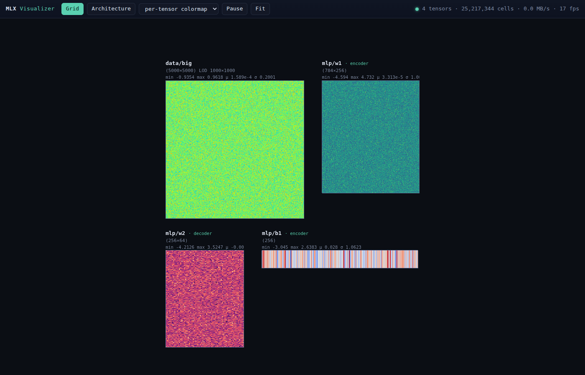
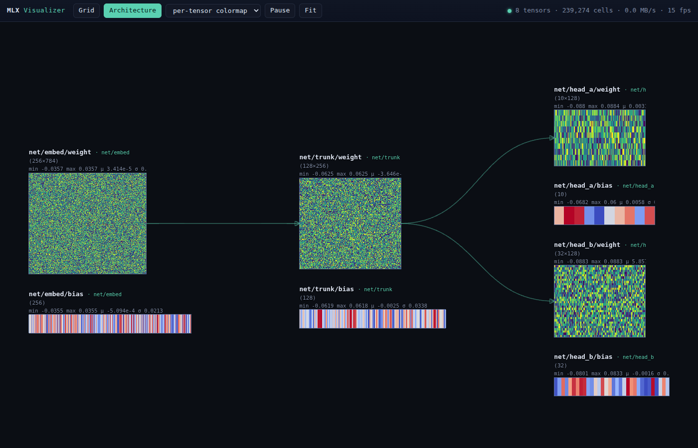

# MLX Visualizer

Live, asynchronous visualization of large matrices and vectors — MLX arrays,
NumPy arrays, or torch tensors — in a beautiful, space-efficient web view that
also shows the architecture connecting them. Designed so that watching your
data costs your computation essentially nothing.



## Highlights

- **Asynchronous by construction.** The visualizer owns a background thread
  with its own event loop. Snapshotting, reduction, encoding, and network I/O
  happen there. MLX GPU watches cooperatively stage a CPU copy on their owning
  thread because MLX streams are thread-local; all later work stays off the
  compute path.
- **Extremely large matrices.** A 100,000×100,000 matrix is reduced with
  exact block means computed in fixed-size row bands, so peak extra memory is
  bounded regardless of input size. Each capture tick has a wall-clock budget;
  work that doesn't fit is carried over round-robin, so one huge tensor can
  never starve the stream.
- **Batched, low-level rendering.** Every tensor lives on one layer of a
  single `R32F TEXTURE_2D_ARRAY`; the entire scene — any number of panels —
  is drawn with **one instanced WebGL2 draw call**, with colormapping done in
  the fragment shader via a LUT atlas. Rendering cost is independent of how
  many matrices are on screen.
- **Space-efficient, meaningful layout.** Matrix panels preserve their true
  row/column aspect ratio (capped at 8:1). The grid follows topological model
  order and keeps telemetry separate; **Architecture** mode packs busy graph
  depths into compact group-aware lanes. Labels scale and simplify with zoom,
  hide before becoming clutter, and wrap without clipping when expanded.
- **Change-aware streaming.** Frames are fingerprinted (CRC32 of the reduced
  image); unchanged tensors are never re-sent. Slow clients get per-connection
  queues that drop stale frames instead of back-pressuring the pipeline.
- **Live training metrics.** Scalar providers registered with `viz.metric(...)`
  render as bounded, real-time line charts alongside tensor heatmaps, using the
  same asynchronous capture and transport path.
- **Zero dependencies** beyond NumPy: the HTTP + WebSocket server and the
  binary protocol are built in.

## Install

```bash
pip install -e .
```

For the multi-source text training notebook (MLX + Jupyter included):

```bash
pip install -e ".[notebook]"
mkdir -p data
cp /path/to/shakespeare.txt data/shakespeare.txt
cp "/path/to/King James Bible.txt" "data/King James Bible.txt"
jupyter lab examples/shakespeare_transformer.ipynb
```

The local corpus and generated checkpoints are git-ignored.

## Quick start

For an MLX model, one call watches every parameter **and captures the
architecture automatically**:

```python
import mlx.core as mx
from mlx_visualizer import Visualizer

viz = Visualizer()                       # or Visualizer(port=0) for a random port
viz.watch_module("mlp", model, staged=True)  # safe for MLX GPU parameters;
                                             # first forward discovers the graph
url = viz.start()                        # non-blocking; open the printed URL

... optimizer update ...
mx.eval(model.parameters(), optimizer.state)
viz.refresh()                            # run on the MLX/compute thread

viz.stop()
```

Architecture capture traces a real forward pass: every submodule call is
recorded, and edges are built by matching output arrays to the inputs of
later calls — exact dataflow, so branching architectures render as a DAG,
not a chain (with call-order fallback across functional ops like
activations). Pass `sample_input=` (or `trace=lambda: model(a, b)`) to
capture the graph immediately instead of on the first real step; the
instrumentation removes itself after one pass either way.

Recognized Transformer parameters receive concise architecture labels and
role badges. Query, key, and value projections are laid out as parallel
branches into the attention output, followed by clearly marked MLP up and
down projections; the full parameter path remains available in detailed
labels and hover tooltips.

Individual arrays and custom flows still work manually:

```python
viz.watch("weights/w1", lambda: model.w1, staged=True)
viz.watch("weights/b1", lambda: model.b1, colormap="coolwarm", staged=True)
viz.metric("training/loss", lambda: current_loss, history=500)
viz.connect("weights/w1", "weights/b1")            # manual architecture edge
viz.refresh()                                        # after MLX updates
```

Watch anything: MLX arrays, NumPy arrays, torch tensors, or zero-argument
callables returning one. Vectors render as strips, N-D tensors are collapsed
to 2-D, and matrices larger than `max_side` (default 1024) are shown at a
level-of-detail with exact block means (the label shows `LOD`, and hovering
requests the exact element value from the live array over the socket).



## API

```python
Visualizer(host="127.0.0.1", port=8791, *, interval=0.25, max_side=1024,
           tick_budget=0.030)
```

| Method | Description |
| --- | --- |
| `watch(name, provider, *, group="", label="", role="", colormap="viridis", every=1, staged=False)` | Track an array or provider callable. Optional display metadata can provide a short label and semantic role. Use `staged=True` for MLX GPU arrays. |
| `metric(name, provider, *, group="", colormap="turbo", every=1, history=512, staged=False)` | Plot a scalar/provider as a bounded live time series. Use staging for MLX GPU scalars. |
| `watch_module(name, module, *, sample_input=None, trace=None, every=1, param_filter=None, staged=False)` | Watch every module parameter and auto-capture its architecture. Use `staged=True` for MLX GPU modules. |
| `refresh()` | Copy staged watches on the caller/compute thread. Call after `mx.eval(...)`; the worker never touches the original GPU arrays. |
| `unwatch(name)` | Stop tracking. |
| `connect(src, dst)` | Declare a dataflow edge manually (custom flows; `watch_module` does this automatically). |
| `start(open_browser=False)` | Start the worker thread + server; returns the URL. |
| `stop()` | Shut down. Also usable as a context manager. |

A module-level default instance is available for quick use:
`mlx_visualizer.watch(...)`, `mlx_visualizer.connect(...)`,
`mlx_visualizer.refresh()`, `mlx_visualizer.start()`.

Colormaps: `viridis`, `magma`, `turbo`, `coolwarm`, `gray`. NaNs render
magenta and are counted in the panel stats.

## How it stays fast

1. **Capture** (worker thread, budgeted): resolve provider → convert once →
   banded block-mean reduction to ≤ `max_side`² → stats + CRC32 fingerprint.
2. **Transport**: binary frames (12-byte header + JSON meta padded to 4 bytes
   + raw float32 payload) over a built-in WebSocket; unchanged fingerprints
   are skipped, and nothing at all runs while no client is connected.
3. **Render** (browser): float payloads go straight into a texture-array
   layer (zero-copy `Float32Array` view); the whole scene is one
   `drawArraysInstanced` call; normalization and colormapping run in the
   fragment shader; labels/edges are DOM/SVG positioned per frame.

MLX GPU streams are thread-local. For GPU-backed watches, `staged=True` plus
`refresh()` performs the MLX→NumPy copy cooperatively on the training thread;
all reduction, encoding, and transport remain asynchronous afterward.

## Examples

- `examples/basic.py` — live simulation of a 2048² field, its velocity, and a
  4096-element signal.
- `examples/mlx_training.py` — an MLX MLP watched with a single
  `watch_module` call (architecture auto-captured), plus per-layer
  gradient watches.
- `examples/shakespeare_transformer.ipynb` — train and sample a sub-10M
  character Transformer on local Shakespeare and King James Bible text while
  watching loss, throughput, and model parameters update live. Add filenames
  to `SOURCE_FILENAMES` to include more stories.

## Development

```bash
pip install -e .[dev]
pytest
```

The test suite covers the reduction math (banded vs. unbanded equivalence,
non-divisible edges, NaN handling), the wire protocol round trip, the
registry/graph, and full end-to-end tests over a real socket: hello →
snapshots → exact-value pick, LOD for a 4096² matrix, and the
no-resend-when-unchanged guarantee, MLX thread-safe staging, and browser
reconnection.
